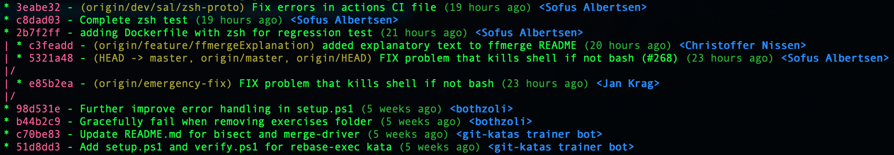
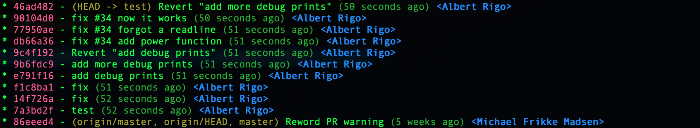
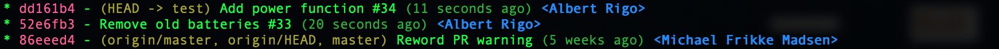

# Git is cool. But how do we use it?


[https://xkcd.com/1597/](https://xkcd.com/1597/)

# Do's and Dont's

Start here
- [Use Git in commandline](#use-git-in-commandline)
- [Read the output from Git](#read-the-output-from-git)
- [If you're unsure, try it](#if-youre-unsure-try-it)
- [HEAD is where the changes should happen](#head-is-where-the-changes-should-happen)
- [Create Git aliases](#create-git-aliases)
- [Write excellent Git commit messages](#write-excellent-git-commit-messages)
- [Make sure your .gitignore is up to date](#make-sure-your-gitignore-is-up-to-date)
- [Practise](#practise)

Working locally
- [Create a local branch](#create-a-local-branch)
- [Commit early and often](#commit-early-and-often)
- [Review before committing](#review-before-committing)
- [Interactively rebase](#interactively-rebase)

Working remote
- [Use rebase as your default merge](#use-rebase-as-your-default-merge)
- [Only fast-forward to master](#only-fast-forward-to-master)
- [Don't rewrite published history](#dont-rewrite-published-history)
- [Pull often](#pull-often)
- [Push as often as you can](#push-as-often-as-you-can)
- [Protect your important branches](#protect-your-important-branches)
- [Update your local repo before you start working](#update-your-local-repo-before-you-start-working)
- [Delete old branches](#delete-old-branches)

Workflows
- [Pick a workflow](#pick-a-workflow)
- [Use Tags to mark releases](#use-tags-to-mark-releases)
- [Use pull requests if it makes sense](#use-pull-requests-if-it-makes-sense)
- [Git is not an artifact management system](#git-is-not-an-artifact-management-system)

Links
- [More reading](#more-reading)

---

NOTE: In the text below, I use the name `master` for the main development branch; the default branch of the repository. If you for some reason have another name for that branch, then you should read master as that name.

---

# More context

## Start here

### Use Git in commandline

If you are new and in progress of learning Git and how to use it. The commandline (or terminal) is a very good way to learn it. It might feel counterintuitive, but Git will tell you what to do and what is wrong. You will be able to use the actual commands and not buttons that might or might not do what you actually want it to do. Many GUI solutions for Git do stuff behind the scenes and if you don't understand the concepts, you won't be able to tell if you need to do something or if something went wrong.

It's hard to create a GUI tool for Git without having a workflow in mind, some kind of preconceived notion on how the creators of the tool think Git should be used, and then build that in. Many times it works good, but you shouldn't let the tools dictate your workflow, your workflow should dictate your tools usage.

On the other hand, most (if not all) Git GUI have improved a lot, so using it as a complement isn't a bad thing, but don't rely on the GUI too much.

### Read the output from Git

One of the best habits you can develop as a new Git user is to actually make sure to always read what Git tries to tell you. It's not fun to do a couple of Git commands and down the line you realize that it didn't work as expected because something you did a few minutes ago didn't work and Git tried to tell you.

Git is not only really good at telling you when something is wrong, it can give you great suggestions on what the next steps are. If you are unsure on what to do next, `git status` is your friend, use it often. I usually recommend that, at least in the beginning of your Git journey, use it after every other command.

```
> git status
```

### If you're unsure, try it

Unsure what will happen? Try it! There is no better way of learning than trying it out. If you don't want to risk your files, then you can try it out in a different *clone* first. Or maybe create a fresh repository in an empty folder and play around there.

```
> git init
```

Unsure what happened? Learn how to use `git reflog` to investigate. It'll basically show you a kind of log of what you've been doing in the repository. To be able to understand the *reflog*, try it out first when you *don't* have problem so you can backtrack and see what it all means.

```
> git reflog
```

### HEAD is where the changes should happen

One of the best habits around is to make changes on the branch you don't stand on. It's very possible to make changes on any branch from anywhere. If you know what you're doing it can be some kind of shortcut, but it's basically always a more complicated way of doing a multi-step operation. For example:

```
> git checkout topic
> git rebase master
```
Is the same as `git rebase master topic` but you will make less mistakes.

If you develop the habit of standing on the branch you want to change, then you will avoid some of the most common mistakes new Git users happen upon. For instance *rebasing* the branches in the wrong order might not give you the result you are looking for.

Another scenario when it's better to update HEAD instead of trying to giving Git more arguments and update something else is when doing `git pull`. If you want to update your master branch with the latest on the remote, please checkout master first and then run the `git pull` command. It'll save you loads of headache.

### Create Git aliases

If you're using longer Git command regulary, it's a good idea to create an *alias* for it. One of the most used one I have is a nice log print.

```
> git config --global alias.l10 "log -n 10 --graph --pretty=format:'%Cred%h%Creset -%C(yellow)%d%Creset %s %Cgreen(%cr) %C(bold blue)<%an>%Creset' --all"
```
If you have the above *alias*, writing `git l10` will give you the something like the following output (the example is from the git-katas repository):



Using aliases isn't magic, it just replaces the *alias* with the command, so if you have an *alias* you can always add more stuff after it. For instance in the *alias* above you could add `-n 20` if you would like to increase the output size to 20 instead of the defaulted 10:

```
> git l10 -n 20
```

### Write excellent Git commit messages

<a href="https://xkcd.com/1296/"></a>

Git commit messages are your way of telling everyone (including future you) what you've been doing. Writing uninformative commit messages will make it a lot harder to fix bugs and understand the code when doing maintenance. Additionally, it'll be possible to gather commit messages as a crude form of release notes.

There are a couple of good rules you should try to follow:
1. Separate subject from body with a blank line
1. Limit the subject line to 50 characters
1. Capitalize the subject line
1. Do not end the subject line with a period
1. Use the imperative mood in the subject line
1. Wrap the body at 72 characters
1. Use the body to explain what and why vs. how

I won't go into the details, but read the following blog post for deeper understanding - [https://chris.beams.io/posts/git-commit/](https://chris.beams.io/posts/git-commit/).

Now, remember that this is for the commits that will live on for the future. You don't really need to be so hard on the commit messages if you're working on a feature branch and know that you'll rebase interactively later on, or if you need to push some things to a remote temporary branch to be able to build.

### Make sure your .gitignore is up to date

Keeping your files under version control is what we try to do here, but some things should never reach the repository, for instance:
- object files, build files and auto generated code that can be generated by the code in the repository
- settings for your editor

A good page for finding what to ignore is to look up the language(s) you're using at [gitignore.io](https://www.gitignore.io/). There you'll find an excellent start and you can use that as a base for your `.gitignore`.

### Practise

The saying goes that practise makes perfect and who am I to argue about that. If you're using Git daily and doing different operations all the time, then you are basically practising. If you're not a daily Git user, or if you only use a few Git operations in your work, you need to find another way of practising. There are awesome [git-katas](https://github.com/praqma-training/git-katas/) out there, and spending something like half an hour on them weekly will be a great investment of your time. Because when the problems come (and believe me they will), you will be much better equipped to handle them.

## Working locally

### Create a local branch

When you work on something on your machine, it's always a good habit to create a local branch and work there. If you need to take a break and work on something else, you just switch branch because your code is already separated. If remote master have changed and you *pull* in the middle of your work, you can easily update your local master (it's going to be a *fast forward*) and then *rebase* your branch on top of master. Also, when you're done with the local work and want to deliver it, cleaning up what you've done in a nice manner (for instance with [interactive rebase](#interactively-rebase)) is the common way of working and then adding it on top of your local master before pushing it.

If you anyway decide to work on the local master, you better make sure that your commits are nice from the start, because when you start pulling from remote ([with rebase](#use-rebase-as-your-default-merge)), it'll be harder (but not impossible) to make it neat and nice.

### Commit early and often

This is actually two tips in one. It could mean any of:
- Each change should be the smallest logical change possible.
- While developing, make micro checkpoints

*Let's start with the second point first.*

Keep in mind that even if you commit very often, not everything you commit is available to everyone else. Committing every time you made a change on your local branch will not affect anyone except you. Sometimes, especially in early development or during rebasing, you'll go back and forth and try out things. Making small checkpoints on the way could help you a lot, if you know how to use it.

When you feel you've done enough to submit your issue, you will then need to fixup your history (did someone say [interactive rebase](#interactively-rebase)?), and having you train of thought written down in the commit log will help you in the rebasing. So don't forget to write your commit messages fairly ok, at least so that you will remember what they mean a couple of days later.

*What is a smallest logical change possible?*

Let's say that you deliver a feature, the change is rewriting one function, adding two functions and a configuration cnange. You should ask yourself, can any of these live (and be delivered) on their own? If they can, then the feature can be split into smaller logical changes.

In a dream scenarion, the rewritten function, the new functions and the configuration change are all logical changes that can live by themselves (even if you would still need all of them to add the feature) and are all different commits.

Why should we split a feature into multiple commits? Good that you asked, think about Lego. If you've created multiple commit that can live by their own, you've basically built Lego blocks. And if the commits are Lego pieces in the commit history, then each one of them can be reused, replaced and refactored in a controlled way.

### Review before committing

Mistakes happen and it's often easier to be preventive than fix the mistakes. One good habit to have, before doing `git add`, is to check what will actually be added and only add the files you need to add.

```
> git status
> git diff
> git add <your file(s)>
```
If you're lazy (like me sometimes), you'll end up writing `git add .` and everything you've changed (and all the new files) will end up in the commit. Maybe not always what you wanted.

Sometimes you don't want to add multiple changes in the same file, then `git add -p` is a neat way of selecting blocks of changes for the commit. I recomment that you experiment with it.

```
> git add -p
```

### Interactively rebase

When working on your local branch and it's time to push it, you might have some things you need to fix. For instance *debug print* commits that you reverted, commit messages that needs to be fixed. References to your issue handling system that you forgot. The list goes on. Use interactive rebasing to cleanup your branch before it's ready to be delivered.

*Before interactive rebase:*


```
> git rebase master -i
```
*After interactive rebase:*


## Working remote

### Use rebase as your default merge

Keeping your local master branch up to date is pretty important. Because everything you deliver (push), should be based on the latest on master and if your local master isn't up-to-date with the remote master, then you'll get into trouble (either by not being allowed to deliver or, even worse, nothing is stopping you and your delivery is merged with the remote master and it'll end up in an unknown state) Assuming you've read about [creating a local branch](#create-a-local-branch) above, and are trying to follow it, keeping you local master updated shouldn't give you too much headache.

The default behaviour of a `git pull` is that Git will fetch `origin/master` and then merge that branch to your `master` branch (assuming you stand on `master` when performing the operation).

*Is merge bad?*

Merging has its uses, but in many cases you want your local master to be a mirror of the remote master, and the default behaviour will either you get a merge conflict (which can be very confusing) or it'll happily merge and you wouldn't know something is wrong until later. Best case scenario, you'll get an extra commit (a merge commit) that'll end up in your git history, taking place and confusing a future reader.

*Using fast-forward-only as default when you pull.*

Often you want your local master to mirror the remote master; only allowing fast-forward changes when you pull (`git pull --ff-only`). This will have the benefit that it'll abort the pull if something is wrong (for instance you have accidentally committed something on your local master). This is especially true if your workflow is to use *pull requests* or *ready branches*.

```
> git pull --ff-only
```
If you always want to use this way, you can set this as the default pull operation in your gitconfig. That way you don't need to add the `--ff-only` option to `git pull`.
```
> git config --global pull.ff only
```

*Using rebase as your default merge.*

Unless your workflow specifies it, you should really use rebase as your default pull operation, either by always writing `git pull -r` or by setting it as default in your gitconfig:

```
> git config --global pull.rebase true
```

### Only fast-forward to master
This has been touched upon in a couple of points already, but it's so important it gets a point of its own.

Why should you *only fast-forward to master*?

The master branch is the branch that everything else is built upon. It's also the branch that all developers are using - although sometimes indirectly via feature branches. This means that if you happen to change the history of the master branch, this could make life much harder *for everyone else* that is using that branch.

It's also important to think about this when working locally. If you happen to change the history of your local master branch, then this will only affect you. Maybe not directly, but when you later in your work want to push it to remote and can't.

If you make changes to master - only fast-forward.

### Don't rewrite published history
The same tip as for master goes to most branches on the remote. If something is pushed, the odds are that somebody is working on that branch. Unless you know for a fact that the branch is ok to rewrite, don't do it. Even if it's a "just feature branch" it could be devastating for some developers if you rewrite the history.

In general, don't rewrite published history multiple people work on.

### Pull often

Keeping your local master and other branches that you base your work on fairly up-to-date could help you in the long run. You don't need to pull all the time, just often enough so that when you want to push, you don't get a big merge you need to solve. You could say that every time you're at a checkpoint in your development, pull and rebase your feature branch before going to the next step.

### Push as often as you can
If you pull and rebase at every mental checkpoint, why not make the habit of pushing that? If you try to do that you will make it easier for your colleagues because they will not suffer a "big bang merge" which will be the case if you wait too long before pushing.

### Protect your important branches
We've mentioned that you shouldn't change the history on master branches and other important branches, but mistakes do happen. What you should do is set up your git remote (for instance GitHub) so that it's not possible to force push.

Another, a bit more work needed, protection is to protect your important branches from any direct pushes, and only allow a CI server to make the pushes for you. This do require more work, and a CI server. The benefit is that you'll have a robot gatekeeper that can execute different kinds of tests, increasing the chance of having master stable.

### Update your local repo before you start working
Update your local repo before you start working from the remote([read this](#use-rebase-as-your-default-merge)).
- Update your master, then rebase your local branch that you work on onto master.

### Delete old branches
Have the habit to delete branches that aren't needed. Good branch hygiene. Both locally and remote.
```
> git fetch --prune
```

## Workflows

### Pick a workflow
Use your workflow. If you don't have one, pick one or make one. It's important that your workflow is clear and concise for everyone that should follow it. If you don't understand some parts of the workflow or your solutions differ from the workflow, then make sure to gather the team and talk about it. Maybe the workflow can be improved, or maybe you learn something new.

### Use Tags to mark releases
Do not create branches "just in case".

### Use pull requests if it makes sense
*If a tool mentions `merge requests`, then that's the same thing as `pull requests`.*

Don't use human code reviews as the main quality tollgate. In a best case scenario, you have automated tests that verifies that the product does the things right.

Use pull requests for:
- Validating that the product does the right thing
- Knowledge sharing

Do not use pull requests for:
- Verifying that the product does the thing right
- Checking coding guidelines

One of my pet peeves with pull requests is that they are a hindrance in the value flow. Without pull requests, you don't need to wait until the automation system can pull the change into production. This, however, sets certain requirements that you can test and verify the changes in your pipeline. Also to consider is that an automation system can seldom validate the changes. So, how to keep human validation and knowledge sharing, but still not stop the pipeline? What I suggest is that you, once a week (depending on your change rate), have a validation time slot, where the senior developers (the ones that usually are the pull request approvers) - and everyone that has the time - checks all changes that went through since the last time you had a validation time slot. During this time slot, you validate that the changes actually solved the right problems and you get a knowledge sharing session as a side effect. In this way there's no stop in the pipeline and all approvers don't need to context switch between their work and approving code changes.

### Git is not an artifact management system
- Avoid large binaries (Word documents are binaries)
- Don't commit auto generated files if they can be generated on the fly

# More reading

- [git katas](https://github.com/eficode-academy/git-katas)
- [opinionatedgit.com](http://opinionatedgit.com/)
- [dangitgit.com](https://dangitgit.com/en)
- [gitignore.io](https://www.gitignore.io/)
- [commit messages](https://chris.beams.io/posts/git-commit/)
